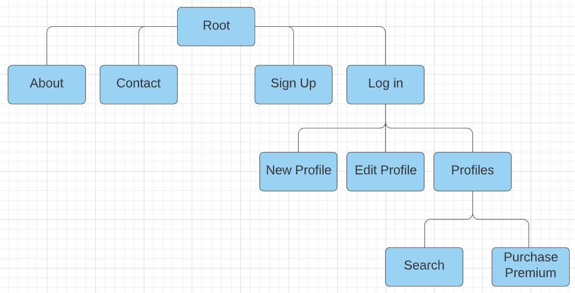
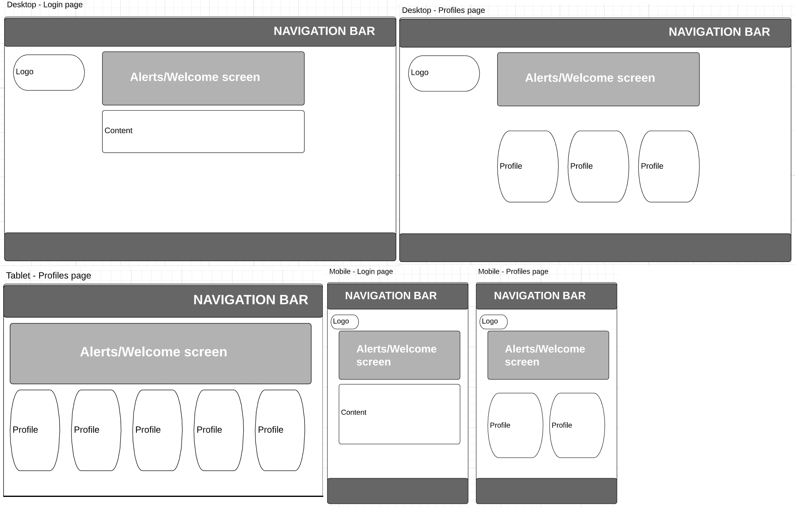

# README

### R7	Identification of the problem you are trying to solve by building this particular marketplace app.
    This app seeks to solve the problem of not having a dedicated dating app for global-scale connections and relationships.  Tinder, Bumble, plentyoffish, okcupid, etc, all are focussed primarily on finding someone close to you.  Planetlike was built from the bottom-up with the intention of blurring the lines between locales.  The aim is to make the world feel smaller.

### R8	Why is it a problem that needs solving?
    In this high-tech time, the world is very small.  We are more connected than ever, and so we no longer need to limit our relationship criteria to someone who is within 50km's of our location.  Travel is cheap and remote work is on the up and up, so this app is filling a growing need in the market.

### R9	A link (URL) to your deployed app (i.e. website)
    https://planetlike.herokuapp.com/

### R10	A link to your GitHub repository (repo).
    https://github.com/Radicals27/planetlike

### R11	Description of your marketplace app (website), including:
- Purpose: To connect people from all around the world with each other,maximising the chances of finding a highly-compatible partner.
- Functionality / features: User registration, profile browsing according to gender and orientation, advanced search feature, premium membership that allows user to user communication.
- Sitemap: 

- Screenshots: 

- Target audience: Anyone over the age of 18 looking for anything from a penpal, friend to a serious relationship.
- Tech stack: The application uses Ruby on Rails 6, HTML5, CSS3, and is deployed in heroku (www.heroku.com)

### R12	User stories for your app
* As a user I want to be register an account
* As a user I want to be able to create a profile
* As a user I want to be able to edit my details/profile
* As a user I want to be able to search for specific criteria
* As a user I want to be able to see other people's profiles
* As a user I want to be able to message other users
* As a user I want to be able to become a premium user

### R13	Wireframes for your app

### R14	An ERD for your app

### R15	Explain the different high-level components (abstractions) in your app
* The application was constructed following a Model-View-Controller methodology. They can be broken down as follows:

#### Conversation:
    The conversation model handles the connecting of a recipient and a sender with a conversation ID in a joining table.  The conversation view displays all of the user's that the current user has previously messaged or who they have received messages from.  Finally, the conversation controller handles the validation of the current user's premium membership, prior to allowing them to use the messaging feature.  As well as this it controls the parameters passed to the conversation view as well as the actual creation of the conversation in the database.
    
####  Message:
    The message model
####  Profile:
####  User:
####  Role:
####  Search:

### R16	Detail any third party services that your app will use
    The app utilises Stripe's payment handling system (www.stripe.com) incorporated as a Gem in the Gemfile.
    Images are stored by implementing Cloudinary & Active Storage, using the API and assosciated Gem.
    It also utilises Bootstrap, incorporated as a Gem in the Gemfile.

### R17	Describe your projects models in terms of the relationships (active record associations) they have with each other

### R18	Discuss the database relations to be implemented in your application

### R19	Provide your database schema design

[Schema File](db/schema.rb)

### R20	Describe the way tasks are allocated and tracked in your project
